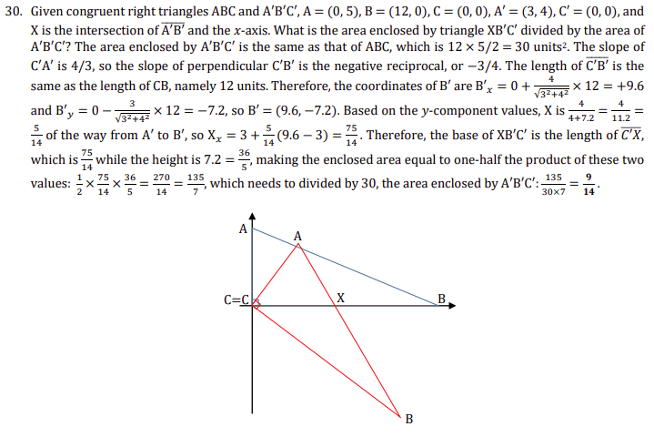

<nav id="toc" markdown="1">

## Table of Contents
{:.no_toc}

* toc
{:toc}

</nav>


## Introduction

The accessibility of mathematical content presents some unique challenges in terms of choosing the most natural reading, as well as of the ambiguity of common notations. Often a mathematical formula is simply "read off" as if directly from the display. For example $a_b$  might be read as "a sub b", or $(x,y)$ read as "open parenthesis x comma y close parenthesis". In other cases, the preferred reading may depend on (an approximate) "meaning" of the formula, such as $(x,y)$  being read as "the point x,y". Yet, that same expression may in fact represent "the open interval from x to y", (or a list or line segment, or ...) rather than a point, thus calling for disambiguation


There would appear to be a range of approaches to properly voicing mathematical formulas: At one extreme, one would simply encode exactly what is to be said; a more aria-like approach. At the extreme, one provides the complete "semantics" of the formula, either by annotating the displayed form, or using MathML’s parallel markup, leaving it to the user agent to formulate the speech. The details of these approaches, along with their difficulties and limitations of these approaches, will be discussed below. We seek a practical solution, possibly a middle ground,

## Goal

MathML is divided into two parts:  Presentation MathML describes the arrangement of math symbols, while Content MathML describes the composition of math operators.  These two subsets of MathML carry complementary information and can be used separately, or combined using Parallel Markup.  Neither of these forms carries adequate information to provide high-quality accessible output.  While some semantic information is explicit or can be inferred, other aspects of the semantics must be provided by an author to resolve ambiguities in conventional math notation to make the MathML encoding more fully accessible.  This document examines two central questions:

* What additional semantic information is needed beyond current MathML and how should it be encoded?
* How should that information be communicated to an end user to provide greater access to math content, especially for vocalization of math by Assistive Technology (AT), especially screen readers?

This document makes no conclusions. It lists some of the strengths and weaknesses of the approaches presented. The reader is invited to comment on those approaches and/or provide alternatives as the WG wants to come to a solution that works within the web platform to address the problems noted below.


The goal is to allow authors/authoring tools the ability to capture, in MathML, enough information so an expression can be correctly rendered by screen reader applications. It is likely that additional information that aids accessibility can also be used to improve search of mathematical expressions, but the focus of this document is on enhancing accessibility.


The Working Group is committed to backwards compatibility.  Any solution to these problems should not invalidate old documents, but should allow progressive enhancement of existing content.  Moreover, authors should be able to enhance the math contained in their documents as little or as much as they choose.

### Current State
#### The problem of ambiguity

Common mathematical expressions such as $ax^2+bx+c=0$ are mostly unambiguous. However there are some notations that are ambiguous which makes interpretation difficult. For example, $M^T$ could be “M” raised to the power “T” or it could be the transpose of a matrix “M”, it could be a set of mappings from the set “T” to the set “M” or the component “T” of a contravariant vector  “M”.  Another example is $(a,b)$: this could represent a point, or the open interval from ‘a’ to ‘b’, or the gcd of ‘a’ and ‘b’. There are several other potential interpretations. It is also the case that different notations can be used to represent the same concept. For example $]a,b[$ is also sometimes used to represent the open interval from ‘a’ to ‘b’ (but not the gcd, etc). These ambiguities present difficulties for accessibility, search, and computation as discussed below.


To keep this document short, only the first of these will be shown below, but links to how all the examples might be handled for each approach are provided in the sections below..

### Math Accessibility details on the Web

AT usually gets information about a web page through accessibility APIs provided by an OS. The information used is built by the browser from the browser’s DOM and is represented in a parallel structure called the Accessibility Tree. In general, the accessibility tree is a simplified version of the DOM in that only information needed by AT is exposed. For example, a span with no semantic information will not be part of the accessibility tree. A more detailed description can be found in [MathML Accessibility API Mappings 1.0](https://w3c.github.io/mathml-aam/#dfn-accessibility-api) [early stage working draft, 2021].


The platform APIs in general have not provided much support for mathematical notation beyond a generic “math” role. However,  ATK (used by Orca) added a few roles to support math in 2015; that support is not sufficient to represent a number of mathematical notations (e.g., “munder” and “msubsup”). Apple has tentatively(?) added MathML equivalent roles to AX API (based on what is listed in the [MathML API Mappings](https://w3c.github.io/mathml-aam/#mapping-mathml-to-accessibility-apis)), but those (sub)roles are not documented anywhere on Apple’s website. The current state appears to be:
Windows -- because of the lack of MathML mappings on Windows, AT on Windows currently gets MathML from the DOM for accessibility.
Linux -- it appears that browsers put MathML tags and attrs that do not have supported roles [into the accessibility tree via object attributes](https://w3c.github.io/core-aam/#mapping_nodirect) and AT (Orca) gets the info from there
macOS/iOS -- it appears that Safari adds the MathML-equivalent tags; need to find out what happens to the attrs ?

#### Android -- ???


MathML and SVG live in somewhat parallel worlds in their relationship to HTML. [SVG Accessibility API Mappings](https://www.w3.org/TR/svg-aam-1.0/) (working draft, May 2018) gives details on SVG accessibility. In general, the document recommends adding ARIA to enhance the accessibility of SVG. Specifically, it states that shape elements (circle, etc) among many others do not go into the accessibility tree unless given semantics via ARIA (e.g, by aria-label). Also, more germane to MathML, elements that do not render visually should never be in the accessibility tree. For MathML, these invisible elements include the non-presentational part of semantics, maction, etc. Unlike math, there is no specialized braille language for graphics, nor is there an expected way SVG objects should be spoken in the absence of ARIA enhancements.


Ideally, platform APIs should allow those tags and attributes of MathML that have semantic value to be exposed in a straightforward manner. Most MathML tags have semantic value; some attributes do also. Examples of attributes that have semantic value are token elements’ “mathvariant” attribute and mfrac’s “linethickness” and “bevelled” attributes (binomial coefficient if equal to 0 and Nemeth code difference, respectively).


### Accessibility of Mathematical Content

For years, the accessibility of math in print, and later on the web and in other formats has been a large pain point. Typically, inaccessible images were used. Even when alternative text was provided, the text could not be converted to braille or navigated in a useful manner; only word-by-word navigation was possible.


The use of MathML has dramatically reduced these problems, but ambiguities in math notation mean that semantic speech can’t be reliably generated. For example, $(x,y)$ could be the coordinate of a point or it could be the open interval from x to y. Braille encodes them the same and of course speech could have the literal reading "open paren x comma y close paren". However, this is not how someone would typically read it. Instead they would say something like "the point x comma y" or "the open interval from x to y". There is a supposition that semantic readings are "better", but this has not been confirmed by research for people that are blind; studies do show that semantic reading styles are better for individuals with dyslexia and other non-visual print disabilities.. Nonetheless, it is widely assumed because people/teachers in practice say this and listeners are used to it. The claim is easiest to showcase in examples where the presentation is much more verbose than speaking out the mathematical objects and operations, as would be continued fractions, large identity matrices, or stacked embellished operators such as partial derivatives. All of these examples are easily identifiable to sighted users, but those relying on speech would need to wade through a long speech stream if the presentational details are fully described.


In general, math braille is presentational in that the braille describes the math that is seen, so problems with Presentation MathML are much fewer for braille generation. The WG has identified three examples where braille is not presentational in Nemeth code (a common braille math code in the US and some other countries):

* The combinatorial symbol $\binom{m}{3}$  is easily confused with a 2x1 column vector. Note that Nemeth braille can express these two cases unambiguously, so we can promote them as “best practices”. The combinatorial for `\binom{n}{k}` is ⠷⠝⠩⠅⠾ and the matrix is ⠠⠷⠝⠠⠾⠠⠷⠅⠠⠾
* “:” either is a ratio (which has spaces on either side in Nemeth) or something else (mapping, field extension, …) which is prefixed with a punctuation indicator and has no spacing. Note there is a ratio code point in Unicode (U+2236), but its use is not common in MathML.
* Vertical Bar ( \| ) has many meanings. When used as a sign of comparison as defined by Nemeth code, it has spaces around, otherwise it doesn’t. Examples of a sign of comparison: $\lbrace x \mid x \in ℝ\rbrace$ and $P(A\vert B)$. Examples where it is not a sign of comparison: $\vert x\vert$ and $x\|3$ (x divides 3).

### Example of Math \[[MathCounts](https://www.mathcounts.org/sites/default/files/2020%20Chapter%20Competition%20Solutions.pdf)]



 
An example of non-semantic, presentational speech for this paragraph is:

> “Given the congruent right triangles A B C and A superscript prime B superscript prime C superscript prime [pause] A equals open paren 0 comma 5 close paren [pause] B equals open paren 12 comma 0 close paren [pause] C equals open paren 0 comma 0 close paren [pause] A superscript prime equals open paren 3 comma 4 close paren [pause] C superscript prime equals open paren 0 comma 0 close paren [pause] and X is the intersection of modifying-above A superscript prime B superscript prime with bar and the x axis [sentence pause] What is the area enclosed by triangle X B superscript prime C superscript prime divided by the area of A superscript prime B superscript prime C superscript prime ? [sentence pause] The area enclosed by A superscript prime B superscript prime C superscript prime is the same as that of A B C, which is 12 times 5 divided by 2 equals 30 units sup 2 [sentence pause] The slope of C superscript prime A superscript prime is 4 divided by 3 [pause] so the slope of perpendicular C superscript prime B superscript prime is the negative reciprocal [pause] or minus 3 divided by 4 [sentence pause] The length of modifying-above C superscript prime B superscript prime with bar is the same as the length of C B [pause] namely 12 units [sentence pause] Therefore [pause] the coordinates of B superscript prime are B superscript prime sub x equals 0 plus start-fraction 4 over square-root of 3 sup 2 plus 4 sup 2 end-square-root end-fraction times 12 equals plus 9.6 and B superscript prime sub y equals 0 minus start-fraction 3 over square-root of 3 sup 2 plus 4 sup 2 end square-root end-fraction times 12 equals minus 7.2 [pause] so B superscript prime equals open paren 9.6 comma minus 7.2 close paren [sentence pause] Based on the y-component values [pause] X is start-fraction 4 over 4 plus 7.2 end-fraction equals start-fraction 4 over 11.2 end-fraction equals start-fraction 5 over 14 end-fraction of the way from A superscript prime B superscript prime [pause] so X sub x equals 3 plus start-fraction 5 over 14 end-fraction open paren 9.6 minus 3 close paren equals start-fraction 75 over 14 end-fraction [sentence-pause] Therefore [pause] the base of X B superscript prime C superscript prime is the length of modifying-above C superscript prime X with bar [pause] which is start-fraction 75 over 14 end-fraction while the height is 7.2 equals start-fraction 36 over 5 end-fraction [pause] making the enclosed area equal to one-half the product of these two values [pause] start-fraction 1 over 2 end-fraction times start-fraction 75 over 14 end-fraction times start-fraction thirty 6 over 5 end-fraction equals start-fraction 270 over 14 end-fraction equals 135 over 7 end-fraction [pause] which needs to divided by 30 [pause] the area enclosed by A superscript prime B superscript prime C superscript prime [pause] start-fraction 135 over 30 times 7 end-fraction equals start-fraction 9 over 14 end-fraction [sentence-pause]”


A better rendition which takes into account the author’s intent is:

> “Given congruent right triangles A B C and A prime B prime, C prime, A equals the point 0 comma 5 [pause] B equals the point 12 comma 0 [pause] C equals the point 0 comma 0, A prime equals the point 3 comma 4 [pause] C prime equals the point 0 comma 0, and X is the intersection of the line segment A prime B prime and the x-axis. What is the area enclosed by triangle X B prime C prime divided by the area of A prime B prime C prime? The area enclosed by A prime B prime C prime is the same as that of A B C, which is 12 times 5 halves equals 30 units squared. The slope of C prime A prime is 4 thirds, so the slope of perpendicular C prime B prime is the negative reciprocal, or negative 3 fourths. The length of the line segment C prime B prime is the same as the length of C B, namely 12 units. Therefore, the coordinates of B prime are B prime sub x equals 0 plus start-fraction 4 over square-root of 3 squared plus 4 squared end-square-root end-fraction times 12 equals plus 9.6 and B prime sub y equals 0 minus 3 start-fraction 3 over square-root of 3 squared plus 4 squared end square-root end-fraction times 12 equals to minus 7.2 [pause] so B prime equals the point 9.6 comma negative 7.2. Based on the y-component values, X is start-fraction 4 over 4 plus 7.2 end-fraction equals to start-fraction 4 over 11.2 end-fraction equals to start-fraction 5 over 14 end-fraction of the way from A prime to B prime, so X sub x equals 3 plus 5 over 14 times open paren 9.6 minus 3 close paren equals 75 over 14 [sentence-pause] Therefore, the base of X B prime C prime is the length of the line segment C prime X [pause] which is 75 over 14 while the height is 7.2 equals 36 over 5 [pause] making the enclosed area equal to one-half the product of these two values: 1 half times 75 over 14 times 36 over 5 equals 270 over 14 equals 135 over 7 which needs to divided by 30, the area enclosed by A prime B prime C prime [pause] start-fraction 135 over 30 times 7 end-fraction equals start-fraction 9 over 14 end-fraction [sentence-pause]”


There are several ambiguities in the paragraph above. Three of them are:

* $(0,5)$ -- Point, could be an open interval, gcd, cycle, or an ordered tuple, vector etc.
* $\overline{A'B'}$   -- Line segment, could be mean (average), complex conjugate, or just simply “overbar”
* $B'_x$ -- scripted variable

    * subscript: x-coordinate, subscripted-variable, index in a matrix, argument x of the function B′
    * superscript: Prime, could be arcminutes, feet, derivative

These will be used to illustrate different ways of potentially resolving the ambiguity in that notation.


Notes on “baseline” narration:

* capital letters are commonly spoken in a raised pitch by screen readers, although some people use a setting that has them distinguished as "cap a", etc.
* even a purely presentational reading makes, or could make, some easy assumptions for the most common cases, i.e. those from arithmetic. The “slash” is better pronounced “divided by”, an ASCII dash is assumed as “minus”, and the mfrac element is pronounced as if it were a mathematical fraction, even though the MathML element may be used by other vertical notations in math (such as the derivation rules, partial derivatives, the Kroenecker or Legendre symbols, or even a binomial coefficient with the line made invisible). Similarly, an ASCII dot between digits is usually pronounced as a decimal point by AT tools.
* this narration text is focused on producing speech, and has different trade-offs when producing Braille. Generally, the common set of single characters is a lot less frustrating in Braille as there is a single cell corresponding to each character, which is brief and easy to traverse. In speech constructs such as “open paren” or “long left right arrow” can be a mouthful, especially in expressions with many uses of them.

## Leveraging Existing Technology
The Web platform has support for a number of ideas related to some of our goals. We evaluate if they can be applied to MathML today, or could be extended in principle.

### ARIA
ARIA was designed to allow adding additional information to a tag when a tag does not convey the intended semantics/speech. Hence, it seems a natural approach to use for MathML to disambiguate a notation. However, there are a number of issues unique to math that make the use of ARIA problematic without changes to the ARIA spec.


The simplest approach to using ARIA would be to add aria-label to a math tag. There are several problems with this approach:

* The value of the label is a plain text string. Speech cues (such as pauses) can not be added nor can forced pronunciation. In particular, in English, mathematics always uses the long ‘a’ sound, but speech engines have no way to know they are speaking math and so often use the short ‘a’ sound which often makes the math unintelligible. Similarly, mathematical expressions have a different prosody than normal speech, so what is spoken is often harder to understand than it should be.
* Mathematics has its own braille code. The braille used for math differs significantly from the text used for speech. ARIA 1.3 draft adds the attribute ‘braille-labelledby’ so there is the possibility of providing braille, but that is a large ask for the document author to generate braille for math. Furthermore, there are multiple braille codes for some languages (in English, UEB and Nemeth); it is not possible for the author to know which braille code to generate.
* With the exception of ‘maction’, MathML elements are static elements. According to [this blog](https://www.davidmacd.com/blog/does-aria-label-override-static-text.html), aria-label on static elements has poor support in many screen readers.


Mathematical expressions can often be long enough that a user needs to explore/navigate them. This means the simple approach of using aria-label only on a math tag is too simple -- it needs to be placed on all the parts of the expression where the normal reading would be incorrect (at a minimum, from the deepest point in the tree where there is ambiguity to the root). This is a viable approach and SRE in MathJaX does something similar (it doesn’t use aria-label because screen readers don’t support aria-label on MathML elements; it uses JS to read its private attribute).


A downside to this approach is that it is very repetitive: every parent element must include the text used in the child. An appealing alternative is to use multiple aria-labelledby ids instead of aria-label, where the value of aria-labelledby points to the various children. These in turn can point to their children. The problem with this approach is that text can not be mixed in with the ‘id’s used in aria-labelledby so that a square root does not have a child to point to for the “square root of” part of the expression “square root of x plus y”. A few (unpleasant) hacks are possible by introducing elements that don’t display and adding aria-label to them, but this seems like a poor solution. The unit circle example below illustrates the use of aria-labelledby:


```xml
<math aria-labelledby="ex2">
  <mrow id="ex2" aria-labelledby="point varname at-coordinates">
    <mrow id="point" aria-label="point"></mrow>
    <mrow>
      <mi id="varname">X</mi>
      <mrow id="at-coordinates" aria-labelledby="coordinates x y">
        <mo stretchy="false">(</mo>
        <mn id="x">0</mn>
        <mo id="coordinates" aria-label="at coordinates">,</mo>
        <mn id="y">0</mn>
        <mo stretchy="false">)</mo>
      </mrow>
    </mrow>
  </mrow>
</math>
```

A number of issues surrounding the use of aria-labelledby are explored in this [prototype](https://hackmd.io/@dginev/SkBHsZTiO). Additionally, the prototype explores the use of aria-describedby to add additional information such as a variable being a natural number, something you would not want to hear in a full reading of an expression.

### CSS
In many ways parts of the issues or suggestions laid out in this document could have alternatives that lean into aspects of CSS' architecture.  CSS Selectors, for example, provide the platform standard for "selecting" and associating elements in the DOM tree with styling, some of which (generated content, for example) can be used to do some sorts of interesting annotation.  This would be even more pragmatic potentially through efforts in Houdini which might allow us to experiment with "CSS-like languages" which borrow all of the core concepts from CSS, but do not need to operate in the live profile and can potentially enable more ways to think about possible solutions. It is hard to say much more specifically on all of the possibilities until we begin to narrow some options and answer more questions, but one thing that could be somewhat difficult here would be the lack of support for powerful enough selectors.


Here is one way a CSS-like  solution might look:

```xml
<mrow class="point">
  <mo>(</mo>
  <mi class="arg1">a</mi>
  <mo>,</mo>
  <mi class="arg2">b</mi>
  <mo>)</mo>
</mrow>
```

```css
.point {
   Speech: "the point " .point.arg1 " comma " .point.arg2;
   Nemeth: …;
};
```


### Parallel MathML Markup
The MathML standard includes elements to describe the visual presentation of an expression, and elements to describe the functional content of an expression.  These two subsets of MathML can be used independently, or combined using the MathML `<semantics>` element.


The <semantics> element may be used to attach content markup as an annotation to the presentation of a math expression. This style of markup is known as [Parallel MathML Markup](https://www.w3.org/TR/MathML2/chapter5.html#mixing.parallel).  The id and xref attributes in MathML allow parallel markup to encode cross references from one form to the other.  In this way, how a mathematical notation is presented can be connected to how each logical component of it is to be computed, and both sets of information can be clearly connected at each level of the expression tree.


```xml
<semantics>
  <mrow id="x">
    <mo id="x.1">(</mo>
    <mi id="x.2">a</mi>
    <mo id="x.3">,</mo>
    <mi id="x.4">b</mi>
    <mo id="x.5">)</mo>
  </mrow>
  <annotation-xml encoding="MathML-Content">
    <apply xref="x">
      <csymbol>point<csymbol/>
      <ci xref="x.2">a</ci>
      <ci xref="x.3">b</ci>
    </apply>
  </annotation-xml>
</semantics>
```


The `<csymbol>point<csymbol/>` element in the above example shows one style of markup that can be used to refer to operators that are not part of standard content MathML. It is used here to illustrate the style of parallel markup elements that could be used to represent the point example introduced above.  Other strategies to handle references to symbols outside of MathML include URI-style attributes (definitionURL), and attributes that link into OpenMath content dictionaries (cdbase and cd).


The `<semantics>` element has been part of the MathML standard since 1998, so no new technology is needed to support this solution.  However, since content markup is only rarely used in web pages, electronic documents, or math authoring tools, parallel markup has not been widely adopted.


#### Challenges of parallel markup:


* Parallel markup includes both a presentation and a content encoding for each expression, so it roughly doubles the size of the markup compared to either presentation or content markup.


* Due to the ambiguous nature of presentation, most tools do not have the capability or information needed to generate content markup, leading to redundancy between the two representations. For example, a superscript without clear meaning can become an artificial `<csymbol>` in Content MathML with the presentational name “superscript” in systems that are forced to make some choice.


* Since the two forms are not isomorphic, there will be presentation nodes with no corresponding content node, and vice-versa. However, because the semantic information needed to resolve a notation is encoded in a separate branch of the document tree, it poses the challenge to locate and extract the semantics when processing the presentation.


MathML 1 and MathML 2 defined about 140 tags that describe the functional content. This list does not begin to cover the vast amount of mathematical content, so MathML 3 added a means to use a URI to point to external sources to define the meaning of a tag. Although MathML favors using OpenMath standard’s formal dictionaries, any source can be used. Most official (according to the MathML3 spec) content dictionaries are rather formal which can be helpful for search, computation and even theorem proving, but not helpful for accessibility support in that they lack wording to use for speaking the content. However, because any URI can be used, it is possible to link to content dictionaries that have ways to associate speech with meaning. Wikidata is an example of such a dictionary <http://ceur-ws.org/Vol-2307/paper51.pdf>. For example, [the Wikidata definition of “point” is here](https://www.wikidata.org/wiki/Q44946).


Cons:

* Requirement of complex software
* Dependency to CDs
* CDs are hard to create, hard to discover, and hard to reuse in the way their author intended them. There is also little if any tool support around the CD concept.
* Requires deep understanding of XML references
* Hardly readable without visual tools
* Only csymbol elements can link to CD entries
* No context in terms of default CDs / subject area is possible

Pros:

* Already standard
* Rich CDs exists
* Easy to introduce new symbols in CDs, especially in wikidata cd
* Multi-language support
* Default intent possible
* Very flexible from no annotation to partial annotation to full operator tree annotations


## Creating MathML-specific Solutions
Each of the solutions above have problems when applied to math. This has led the group to explore a new MathML-specific solution. The largest drawback to any MathML-specific solution is that it would expand any “MathML exists in its own world” criticism and wouldn’t leverage work done on the web to support existing web technologies, now or in the future. The generic advantage is that the solution would (mostly) not be held hostage hoping for changes to other specifications.

### Intent
We have decided on using the term intent to refer to “the mathematical meaning conveyed by an author”, as applicable to presentation MathML. It is meant to offer a lightweight solution for partial annotation of an expression so that it can be spoken appropriately by AT. The intent syntax borrows some of the insights gained by Content MathML to encode the structure of mathematical operations (an “operator tree”), allowing for incremental narration and navigation that follows the argument structure of a formula.

One proposal is to introduce a MathML-specific intent attribute, whose value encodes a functional expression composed using a mini language of literals (e.g. binomial-coefficient, factorial, sine, open-interval,...) as well as references into the appropriate descendent subtrees, when they act as conceptual arguments in a mathematical notation. .


Such an attribute could be used by an authoring tool, for example, to encode the point  as the expression point(a,b) as follows:


```xml
<mrow intent="point($1,$2)">
  <mo>(</mo>
  <mi arg="1">a</mi>
  <mo>,</mo>
  <mi arg="2">b</mi>
  <mo>)</mo>
</mrow>
```

If  had another meaning, such as an open interval, or an ordered pair, or greatest common divisor, a value other than “point” would be used in the value of “intent”.


Various proposals have been discussed for the syntax to be supported by the intent attribute, most of which functionally equivalent, but with varying trade-offs in markup ergonomics. Global or local identifiers for referencing subexpressions, as well as the verbosity/repetitiveness of annotations are two such aspects. including “Default intent values” for existing MathML presentation forms, including default names for math operators, default rules for applying operators to arguments. These defaults help reduce the amount of markup needed to specify the intent of an expression. While the full encoding of the content markup for an expression is often complex, and often not included with the presentation, the inclusion of the intent markup for an expression is potentially much simpler, and easier to consume as part of the presentation markup.


An advantage of this proposal is that it can be implemented using current technology without changes to other web standards other than specifying the attribute should be part of the accessibility tree built by browsers. While the functional syntax [‘name(arg1, ...)’]  represents a MathML-specific encoding, it is relatively easy to generate and to consume. .


Considerable investigation is underway to collect default names for math operators, and to explore common presentation markup patterns to apply attribute values to express the intent.  Elementary intent examples can often be encoded using only the default intent rules, and many intermediate examples can be handled by encoding ambiguous operators and their arguments.  Even more complex examples such as integral forms where the differential appears as part of the expression for the integrand can be properly separated into their constituent parts.

### Subject Area
Providing a subject area attribute such as subject=”geometry” is an adjunct to ‘intent’ and provides a simpler means of remediating a document in some cases. For example, a publisher might add a subject area to all the math tags in a Geometry book so that the default intent of   is intent="point($1,$2)". The three examples used in this document would all be captured by subject=”geometry” on the math tag: point, line segment, and scripted value (with ‘x’ or ‘y’) are likely what would be the default ‘intent’ in this case. The use of subject to indicate “chemical-formula” is particularly useful for chemistry, where superscripts on elements represent ions not powers; subscripts on chemical elements aren’t pronounced (e.g., $\mathrm{H}_2\mathrm{O}$); and “-” and “=” represent single and double bonds.


The Math WG has not discussed using subject areas much yet. It is likely that, at least initially, the number of known subject areas would be limited to perhaps as few as 5–15 subject areas covering basic math and science areas. The number of changes to defaults is very dependent on the subject area. As with “intent”, subject area can be implemented without changes to other web standards other than needing to be part of the accessibility tree. At least one AT tool (MathPlayer) makes use of user-specified subject areas to override defaults on what is spoken. Classifying mathematics and other sciences is difficult. It is unknown if a broad brush categorization approach to K-14 topics as currently envisioned is feasible; it remains to be investigated.

### Other target applications of MathML

MathML is widely used by assistive technology (AT) to generate speech, braille, and allow navigation of math. It is also accepted and generated by a significant number of computation systems. A number of specialized programs have been developed to search for mathematical expressions that take advantage of MathML, but none of the major search engines make use of MathML.

#### Search
As discussed above, in some situations a very literal vocalization of the displayed formula can be concise and understandable, while in others, or for other users, a more semantically oriented reading is more useful. In the same way, how users will search for mathematical information may be closely tied to the usual way of writing it, or more tied to its semantics, and thus affected by ambiguities. The task of indexing and search of mathematical formulas must therefore deal with some of the same issues as accessibility.

* Examples of what someone might search for
* Pain points -- when is ambiguity a problem?
* Ecosystem pain points -- what is missing for major search engine vendors to provide a high-quality search for math syntax queries? Is there a good query language? Is there a need not being met from students/educators/researchers? Example or two.

#### Structured data via schema.org RDFa annotations
Schema.org is an ongoing effort developing vocabularies for aiding “Rich Results” in information retrieval, endorsed by most major search engines. We did a basic evaluation, with the goal of exposing our rich “intent” information to search engines.

* There are no targeted vocabulary entries for the kind of information we want to enrich in presentation MathML. Loosely related entries were “disambiguatingDescription” and “name”. A prototype of how they could be added to MathML 3 via RDFa can be seen [here](https://github.com/dginev/tiny-mathml-a11y-demo/blob/master/schema_experiment_2.html)
* There are vocabulary items explicitly referring to mathematics, which are specific to applications - “mathSolver”, “solveMathAction”, “mathExpression”, and can not be repurposed as augmentations over MathML.
    * These developments are [recent](https://github.com/schemaorg/schemaorg/issues/2740), and there is some possibility we could request new vocabulary entries for MathML-specific search needs.
* There was no viable outcome in using the existing schema.org vocabulary. Pages with well-indexed structured data did not benefit - querying for the new information we introduced in the annotations returned no results. It is likely that while this data can be accessed by web crawlers, it may not be added to search engines before creating an explicit “Rich result” application.
    * This leads us to believe this avenue will only be viable in close collaboration with browser vendors, even if existing vocabulary entries can be repurposed for our needs.
* The theoretical upside of adopting a structured data annotation approach is to avoid introducing additional complexity inside MathML itself, and delegate all search-related markup to existing technologies. However, it is currently unclear if there is any path to reusing these approaches over math expressions, especially when considering adoption in major search engines.


#### Discoverability


To aid in Search Engines' ability to find pages containing MathML, these pages with MathML should be included in the webpage’s Header Schema.org accessibility metadata.  Currently there is one property which would be appropriate for this which is ‘accessibilityFeature’.  Here is a current [list of the values for accessibilityFeature](https://www.w3.org/wiki/WebSchemas/Accessibility) of which “MathML” and “describedMath” would be appropriate to use.  There are plans to move this work from a W3C wiki page into something more formal, where new values are voted upon by the community but since accessibility metadata is broader than digital publishing it hasn’t yet been decided which group will take on this work.  When this group either gets created or this work falls into another W3C group any new values the MathML group would like them to consider adding can be done at a future meeting.

### Editing/Selecting Mathematical (Sub)Expressions
Applications to edit mathematics need to have a notion of a insertion cursor and a selection. This information may sometimes be useful to preserve during copy/paste, so some additional attributes may want to be added. See [MathML and OMML User Selection Attributes \| Math in Office (microsoft.com)](https://devblogs.microsoft.com/math-in-office/mathml-and-omml-user-selection-attributes/). Note that the insertion cursor or selection may want to be displayed on a refreshable braille display (typically by using dots 7 and 8).

### Conversion, Computation and Transfer
Mathematical formulæ are often the subject of more than just reading and writing.
Formulæ are, in written form, the lever used to request a computation: the resolution of an equation or evaluating an expression made of numbers can easily be made by computing engines which sometimes understand presentation-MathML (but are limited by ambiguities and context): An enrichment such as intents can lower these ambiguities.
Closely connected to computability, the use of formulæ input in a test to assess mathematical competencies can benefit from lowered ambiguities.


Finally, formulæ displayed in a web-page are subject to being transferred to other places where further work can be done applying mechanisms such as copy-and-paste or drag-and-drop. Since MathML can be the content of the transfer (e.g. using the MathML clipboard flavours), receiving applications can benefit of a standardised way of lowering ambiguities.


## Authors/Acknowledgements


This document was a group effort by many members of the Math WG. The WG would particularly like to acknowledge the primary authors of several sections:

* Sam Dooley: Parallel Markup and Intent
* Deyan Ginev: ARIA and schema.org
* Neil Soiffer: Goals, Current State, and Subject Area
